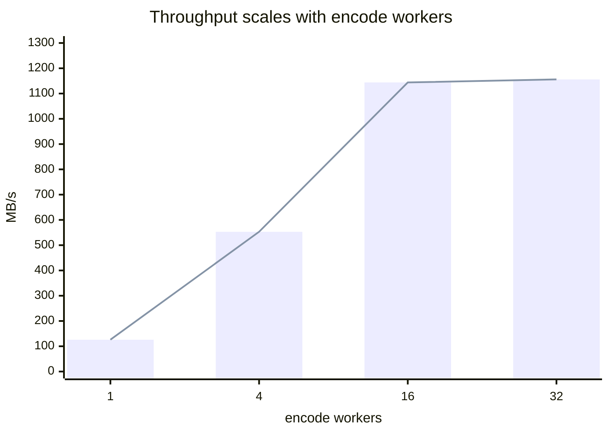
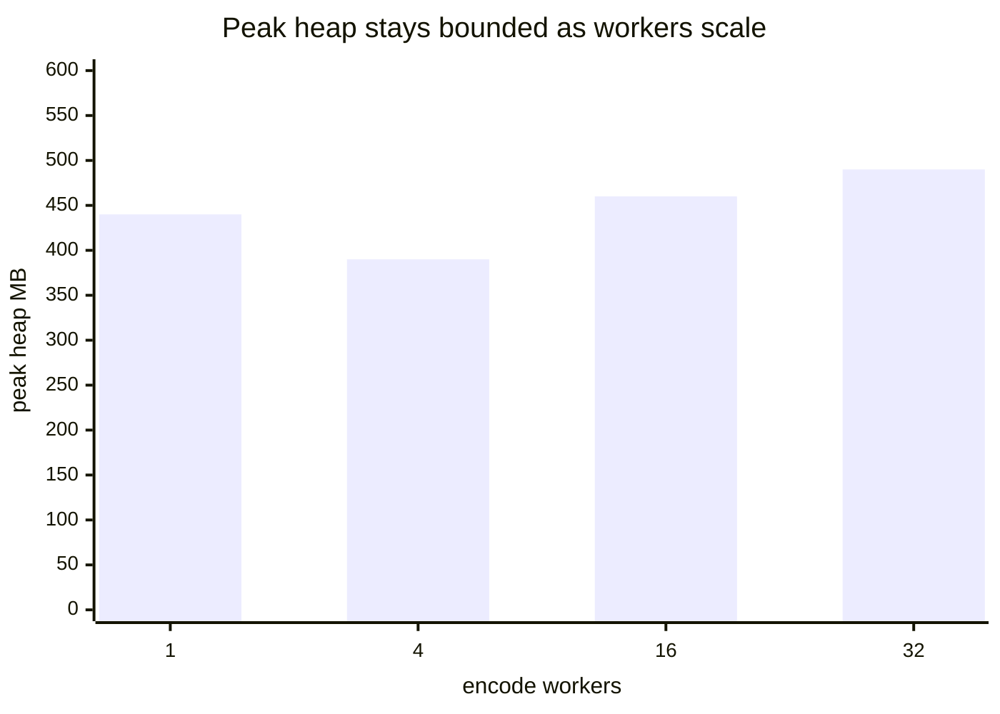

# roost

Streaming Go structs land and settle into DuckDB-friendly Parquet.

`roost` reflects a Go struct once into a fast appender, accumulates rows into
Arrow record batches, and at a roll boundary encodes one Parquet object via a
pluggable `Encoder`, written through a pluggable `Sink`. Output reads back with
`SELECT * FROM read_parquet('./data/**/*.parquet', hive_partitioning=true)`.

## Quick start

```go
type Event struct {
    RSN     int64     `roost:"name=rsn"`
    Time    time.Time `roost:"name=event_time"`
    Region  string    `roost:"name=region,partition"` // -> region=us-east-1/...
    Payload []byte
}

sink, _ := local.New("./data")
w, _ := roost.NewWriter[Event](ctx, sink,
    roost.WithCodec("zstd"),
    roost.WithRollRows(1_000_000),
    roost.WithEncodeConcurrency(4),
)
for ev := range stream {
    w.Append(&ev)
}
w.Close()
```

`Append` takes `*T` and reads it synchronously without ever retaining it, so you
can reuse a single row buffer across calls; a steady stream into already-open
partitions then appends with zero allocations.

## Code generation (optional, zero-reflection)

`NewWriter[T]` uses reflection: no setup, works on any struct immediately. For
hot ingest paths where allocations matter, `roostgen` emits a typed appender
that removes the per-row reflection, in the easyjson style - your `roost:"..."`
tags are read at *generate* time instead of being interpreted on every row.

```go
//go:generate go run github.com/jayjamieson/roost/cmd/roostgen -type Metric
```

```sh
go generate ./...   # writes metric_roost.go next to your type
```

Then swap the constructor - everything else (options, sinks, encoders,
partitioning) is identical:

```go
// reflection (default)
w, _ := roost.NewWriter[Metric](ctx, sink, opts...)
// generated (zero-reflection)
w, _ := roost.NewWriterFor[Metric](ctx, sink, MetricRoostAppender{}, opts...)
```

Both produce byte-equivalent Parquet (guaranteed by the equivalence test), so
switching is just changing the constructor. Regenerate when the struct changes
(same discipline as easyjson/sqlc). See `examples/codegen` for a worked setup
with a checked-in generated file.

## Performance

Apple M5, pqarrow encoder, zstd. Append hot path (partitioned `Metric` with a
`time.Time`, no roll):

```
BenchmarkAppendReflection-10    176 ns/op    1 allocs/op   // NewWriter, reflection
BenchmarkAppendGenerated-10     118 ns/op    0 allocs/op   // NewWriterFor, reused &row
```

`WithEncodeConcurrency` overlaps compression + upload across objects. Measured
against a sink with 30 ms/object upload latency (models an R2 `PutObject`), rows
~104 B:



Throughput scales ~9x from 1 to 16 workers (1.2 -> 11 M rows/s), then plateaus
once it is encode-bound. Peak heap tracks the row groups held in flight while
uploads drain - not the worker count - so it stays bounded as concurrency rises:



| workers | throughput | records/s | peak heap |
|--------:|-----------:|----------:|----------:|
| 1  | 126 MB/s  | 1.2 M/s  | ~440 MB |
| 4  | 553 MB/s  | 5.3 M/s  | ~390 MB |
| 16 | 1144 MB/s | 11.0 M/s | ~460 MB |
| 32 | 1156 MB/s | 11.1 M/s | ~490 MB |

Peak heap is GC-dependent and noisy (±40 MB run-to-run); the point is that it is
bounded, not that it scales. Reproduce with `go test -bench RollConcurrency -benchmem`.

Resident memory is bounded by the row group, not the object: the Writer streams
each filled row group to the encoder and releases it, so a 1 KB roll and a 1 GB
roll hold the same working set (`BenchmarkStreamingMem`).

## Encoders

The default `pqarrow` encoder is pure Go and cross-compiles (no CGO). A DuckDB
encoder lives behind the `duckdb` build tag (CGO + libduckdb) for stacks already
running DuckDB or needing SQL transforms (sort/cluster/aggregate) on write. The
`Writer[T]` surface is identical; swap via
`WithEncoder(roost.NewDuckDBEncoder(...))`.

## S3/R2 sink: single PUT, no multipart

The sink buffers each object to a spill temp file, then issues one
`PutObject` on `Close()` streaming from the seekable file with a known
`Content-Length`. This bounds memory (one object, on disk not heap), needs no
multipart state machine, and lets the SDK retry by seeking. Consumers who want
multipart implement their own `Sink` - it's a 2-method interface.

## Bandwidth limiting

`WithRateLimit(bytesPerSec, burst)` wraps the upload body in a shared token
bucket so concurrent object uploads can't saturate a NIC shared with the
ingest path. The limiter preserves `Seek` so SDK retries still work, and
exposes `Stats()` for throughput observability.
